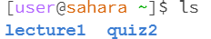
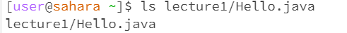
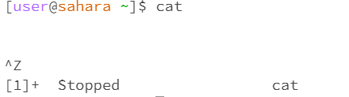
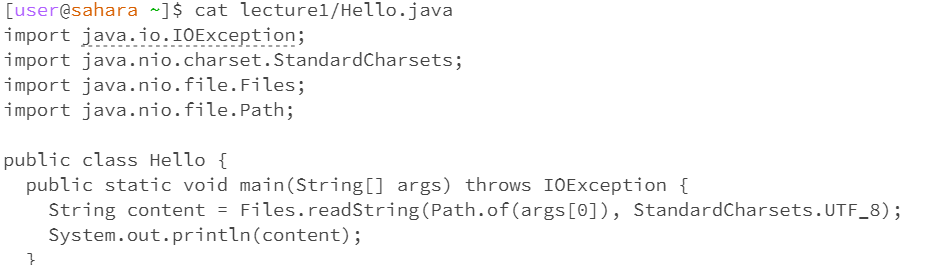

# Lab1 report 1
\
Working Directory: /home\
Explanation: cd means change directory and a directory name is needed after cd,\ there's no directory name here, it defaults cd /home
Error? : no\

Working Directory: /home\
Explanation: change directory to /lecture1\
Error? : no\

\
Working Directory: /home/lecture1\
Explanation: change the directory to home/lecture1/messages/en-us.txt\
Error? : yes, can't change the directory to a file\

\
Working Directory: /home\
Explanation: It shows what's in the home directory\
Error? : no\

\
Working Directory: /home/lecture1\
Explanation: It shows what files are in the lecture1 directory
Error? : no\

\
Working Directory: /home/lecture1\
Explanation: It shows what files are in the Hello.java file\
Error? : Yes, the Hello.java file is not a directory\

\
Working Directory: /home\
Explanation: It shows what's inside a file, this case /home\
Error? : Yes, /home is a directory, not a file\

\
Working Directory: /home\
Explanation: It shows what's inside a file, this case /home/lecture1\
Error? : Yes, /lecture1 is a directory, not a file\

\
Working Directory: /home/lecture1\
Explanation: It displays what's inside a file, this case /home/lecture1/Hello.java\
Error? : no\
